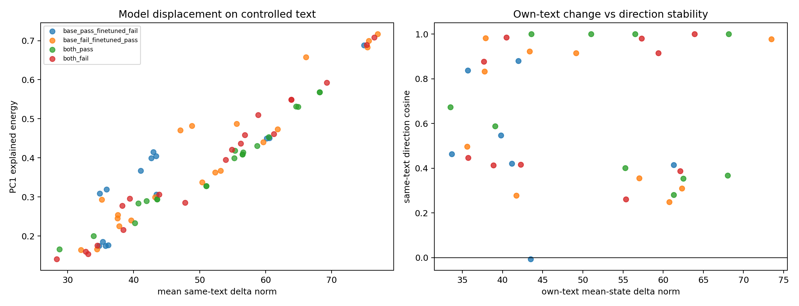

# Intra-task layer-16 direction analysis

## Objective

This analysis asks whether the DeepSeek base-to-finetuned representational
change has a task-specific principal direction related to evaluation outcome.
It explicitly separates:

1. **same-text comparison:** both models process the exact same token IDs for
   the base-generated code and, separately, the finetuned-generated code;
2. **different-own-text comparison:** the base model's mean state on its own
   answer is compared with the finetuned model's mean state on its own answer.

The first comparison controls text. The second describes the deployed behavior
but confounds model change with generated-code change and cannot be aligned
token by token.

## Data and method

- Benchmark: HumanEval+, generation 0.
- Models: `deepseek-ai/deepseek-coder-6.7b-base` and
  `JetBrains/deepseek-coder-6.7B-kexer`.
- Layer: 16, post-layer hidden state.
- Models loaded in the NF4/eager configuration used for activation capture.
- Hidden states are normalized token-wise by RMS before comparison.
- Evaluated code prefixes and paper-v1 v4 labels are used.
- Cohort: all 7 available base-pass/finetuned-fail tasks, plus the first 10
  task-index-ordered examples from each other group (37 tasks total).

The repositories have identical content-token IDs but different automatic BOS
behavior. Same-text inputs therefore exclude model-specific special tokens;
the two tokenizers were verified to produce identical content IDs and exact
cross-decoding. This isolates the model comparison but is not identical to both
models' native BOS conventions.

For each task and source code, the token-level difference is

```text
delta_t = RMS(h_finetuned,t) - RMS(h_base,t)
```

Uncentered SVD of the token-by-hidden delta matrix gives the dominant
within-task displacement direction. The sign is oriented toward the mean
base-to-finetuned displacement. For own-text comparison, unequal token counts
make token alignment impossible, so the analysis compares normalized mean
hidden states only.

## Raw principal directions

The raw token-level displacement is very large and strongly shared across
outcome groups. RMS-normalized vectors have norm 64 in 4,096 dimensions, while
the observed token-delta RMS is usually near 90, the scale expected for nearly
orthogonal vectors. Consequently, raw PC1 mostly describes a global checkpoint
change rather than success or failure.

Group-level PC1 consensus explained 42-66% of task-direction energy for
same-text comparisons and 43-53% for own-text comparisons. This coherence is
present in all four outcome groups and is not itself evidence of a behavioral
mechanism.



## Globally centered outcome test

The checkpoint-wide mean displacement was removed before testing whether
residual task directions cluster by the four evaluator outcomes. The statistic
is mean within-group cosine minus mean between-group cosine. Labels were
permuted 2,000 times while preserving the observed group sizes.

| Analysis | Within cosine | Between cosine | Difference | Permutation p |
|---|---:|---:|---:|---:|
| Same text | -0.0011 | -0.0327 | 0.0316 | 0.1104 |
| Different own text | -0.0244 | -0.0197 | -0.0047 | 0.5362 |

The same-text result is a weak exploratory trend but does not pass a 0.05
threshold. The own-text result provides no evidence that principal directions
cluster by outcome. These p-values address only the prespecified global
clustering statistic; individual centroid comparisons are exploratory and are
not multiple-testing corrected.

## Direction stability within individual tasks

The same-text direction can be compared between the base-generated and
finetuned-generated code for the same task. Mean signed cosine was:

| Outcome group | Mean direction cosine across the two source codes |
|---|---:|
| Base pass, finetuned fail | 0.509 |
| Base fail, finetuned pass | 0.632 |
| Both pass | 0.667 |
| Both fail | 0.668 |

Thus transition tasks are not more directionally coherent than controls on
average. The most stable transition cases are useful for qualitative follow-up:

- improvements: HumanEval/47 (0.982), HumanEval/62 (0.978), HumanEval/36
  (0.923), HumanEval/8 (0.915), and HumanEval/61 (0.834);
- regressions: HumanEval/76 (0.881) and HumanEval/127 (0.838).

These tasks were identified after inspection and must not be treated as an
independent confirmatory set.

## Interpretation

There is a strong base-to-finetuned layer-16 displacement, but the dominant raw
direction is mostly global across tasks. After removing that global component,
this 37-task sample does not establish distinct principal directions for
improvement versus regression. Comparing models on different generated texts
makes the signal less, not more, outcome-specific.

The analysis is still useful operationally: HumanEval/47, /62, /36, /8, /61,
/76, and /127 are candidates where the model-change direction is stable across
both source texts. The next mechanistic step should project the globally
centered task directions into the base-vs-finetuned CrossCoder decoder/latent
basis and test frozen candidate features on held-out tasks. Direct steering on
the raw PC1 would primarily intervene on the global checkpoint difference and
is not justified by these results.

## Outputs

- [`same_text_task_metrics.csv`](same_text_task_metrics.csv)
- [`different_text_task_metrics.csv`](different_text_task_metrics.csv)
- [`group_direction_summary.csv`](group_direction_summary.csv)
- [`direction_group_separation.csv`](direction_group_separation.csv)
- [`group_centroid_cosines.csv`](group_centroid_cosines.csv)
- `task_and_consensus_directions.npz` in the run artifact directory
- [`selection.json`](selection.json)

The reproducible entry point is
`tools/analyze_intra_task_directions.py`. Run artifacts are written under
`runs/intra_task_directions/deepseek_base_finetuned_humaneval_layer16/`.
