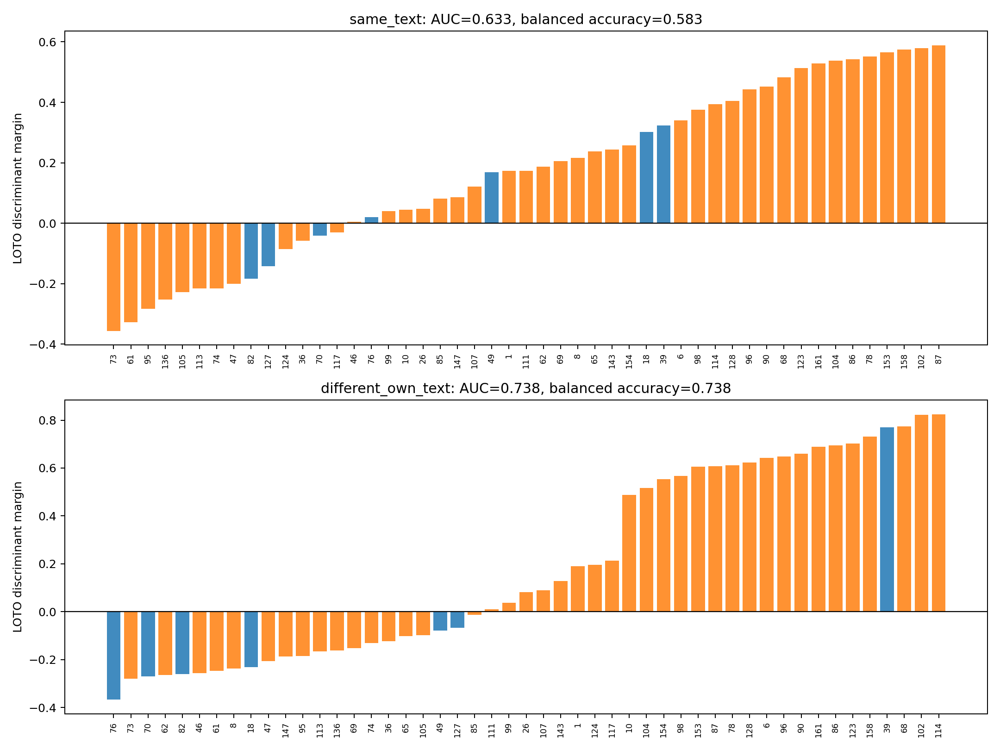

# Leave-one-task-out improvement-versus-regression direction

## Question

The original magnitude-versus-PC1 scatter cannot distinguish directions: two
tasks can have the same displacement norm and explained energy while pointing
in opposite directions. This follow-up learns a linear direction separating:

- improvement: base fails and finetuned passes;
- regression: base passes and finetuned fails.

The analysis uses all 49 HumanEval transitions in paper-v1 v4: 42 improvements
and 7 regressions.

## Out-of-task evaluation

For each held-out task:

1. remove that task;
2. estimate the global base-to-finetuned displacement from the other 48 tasks;
3. RMS-normalize task vectors after removing that training-only displacement;
4. calculate the improvement centroid minus regression centroid;
5. orient the direction toward improvement;
6. set the decision threshold halfway between the two training centroids;
7. project the held-out task exactly once.

Thus every plotted margin is leave-one-task-out (LOTO). The held-out label is
not used to construct its direction or threshold. The complete procedure is
repeated under 2,000 label permutations.

Orange bars are true improvements; blue bars are true regressions. Positive
margin predicts improvement and negative margin predicts regression.

## Results

| Representation | ROC-AUC | Balanced accuracy | Improvement recall | Regression recall | AUC permutation p | Balanced-accuracy p |
|---|---:|---:|---:|---:|---:|---:|
| Same text | 0.633 | 0.583 | 0.738 | 0.429 | 0.165 | 0.271 |
| Different own text | 0.738 | 0.738 | 0.619 | 0.857 | 0.025 | 0.022 |

Same-text model displacement does not provide statistically sufficient
out-of-task separation in this sample. The different-own-text representation
does: it correctly places 6/7 regressions on the negative side, while correctly
placing 26/42 improvements on the positive side. HumanEval/39 is the only
regression predicted as an improvement.

The strongest correctly classified regressions under the own-text analysis are
HumanEval/76, /70, /82, /18, /49, and /127. Strong positive improvement margins
include HumanEval/114, /102, /68, /158, /123, /86, and /161.

## Critical interpretation

The significant own-text result is predictive but not yet a clean causal model
direction. It compares the base state on the base-generated program with the
finetuned state on the finetuned-generated program. The vector therefore
contains both checkpoint change and the code-content difference that produced
the evaluator outcome. It may detect properties of correct versus incorrect
programs rather than a mechanism introduced by finetuning.

Conversely, the controlled same-text result isolates checkpoint change but is
not significant. This weakens the claim that there is already a universal
layer-16 finetuning direction responsible for improvement.

Additional limitations are important:

- only seven regressions are available, so regression recall changes by 0.143
  when one task changes classification;
- feature construction and evaluation use the same benchmark, although LOTO
  prevents direct per-task fitting;
- each fold learns a slightly different direction; no single frozen direction
  has yet been evaluated on held-out tasks;
- the permutation null mean need not be exactly 0.5 because the entire
  imbalanced LOTO training procedure is rerun after each label permutation.

The appropriate next test is to train one frozen discriminant on HumanEval and
evaluate it without refitting on BigCodeBench transition tasks. Steering should
not use the own-text direction until that replication and a same-norm random
direction control are complete.

## Outputs

- [`summary.csv`](summary.csv)
- [`task_scores.csv`](task_scores.csv)
- [`leave_one_task_out_discriminant.png`](leave_one_task_out_discriminant.png)

The reproducible entry point is
`tools/evaluate_intra_task_discriminant.py`. Full fold-specific direction arrays
remain under
`runs/intra_task_directions/deepseek_base_finetuned_humaneval_layer16_all/discriminant/`.
