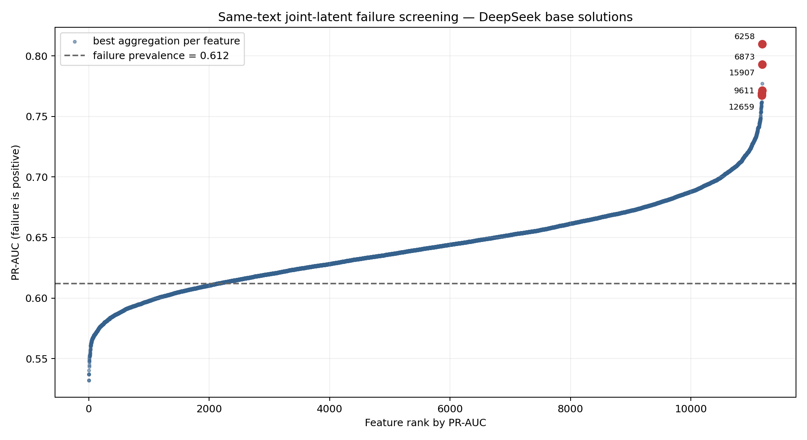

# Same-text joint-latent PR-AUC screening

This experiment forwards each already evaluated HumanEval+ solution through the
DeepSeek base and merged models using identical token IDs. It captures layer 16,
applies per-token RMS normalization, calculates the full joint CrossCoder latent,
and treats evaluation failure as the positive class.

## Coverage and validity

- Retained solutions: **295/328** (152 base, 143 merged).
- Fully skipped: **33/328 (10.1%)** because no paired evaluated token survived the historical finite-state and norm `<500` rule.
- Removed individual tokens: **3295**.
- Token IDs were required to be identical across both model forwards.
- The prompt was excluded. Three valid full-function replacements start at character zero.
- Failure prevalence after filtering: base **0.612**; merged **0.266**.
- Permutations: **200**, seed **42**. `p_maxT` corrects the search over all 16,384 features and all five aggregations.

The exclusions are not missing at random until proven otherwise. Consequently,
this is a screening result, not a final population-level estimate. The analysis
must also be rerun with 5,000 permutations before paper-level inference.

## Top base-solution features by effect/variability

Eligibility for this table requires activation in at least half of retained base
solutions. The graph marks these same five features.

| Rank | Feature | Aggregation | PR-AUC | E/V | p_maxT | Support | Base activation share | Decoder base specificity |
|---:|---:|---|---:|---:|---:|---:|---:|---:|
| 1 | 6258 | p99 | 0.810 | 4.87 | 0.025 | 152/152 | 0.602 | 0.517 |
| 2 | 15907 | max | 0.771 | 4.13 | 0.453 | 152/152 | 0.564 | 0.517 |
| 3 | 12659 | mean | 0.767 | 4.07 | 0.483 | 152/152 | 0.578 | 0.501 |
| 4 | 9611 | p99 | 0.769 | 4.02 | 0.468 | 151/152 | 0.566 | 0.520 |
| 5 | 6873 | max | 0.793 | 4.01 | 0.129 | 150/152 | 0.562 | 0.528 |

Only feature **6258/P99** survives the 200-permutation maxT screen at 0.05. Its
decoder specificity is only mildly base-weighted, however, and its strongest
contexts include scaffolding comments, placeholder code, and incomplete
solutions. It is therefore a strong failure marker but not yet a clean causal
steering target.

Feature **6873/max** is the clearest semantic candidate: its high-activation
contexts repeatedly contain `TODO`, `YOUR CODE HERE`, `pass`, or placeholder
returns. Its adjusted p-value is 0.129, so semantic coherence is stronger than
the present multiple-testing evidence. Features 9611 and 11780 show a similar
placeholder/comment family. This correlation is a warning that the screen may
be finding several redundant detectors of unfinished code.

None of the leading features is strongly base-specific by decoder norm
(approximately 0.50–0.55). Their observed activation is more base-heavy
(approximately 0.56–0.60), but part of that difference can be caused by code
length, label prevalence, and the different solution sets. Decoder specificity
and observed source share should therefore be treated as diagnostics, not as
proof of a base-only mechanism.

## Meaning of the additional diagnostics

- **Decoder specificity** asks whether the feature decoder vector has greater
  norm on the base or merged side. It describes representation geometry.
- **Base/merged contribution** measures the two additive encoder terms before
  ReLU. It helps determine which side drives the joint latent.
- **Task entropy** is high when activation mass is spread across many tasks and
  low when a feature is dominated by a few examples.
- **First P95 position** locates the earliest within-solution high-activation
  token on a normalized 0–1 code axis.
- **First/second quarter activation** tests whether the signal appears early
  enough to be useful for intervention before the final error is expressed.

These fields are descriptive filters. They should not be folded into one score
post hoc. A steering candidate should pass separate gates: adequate support,
failure association, base-side evidence, interpretable contexts, and a planned
directional intervention with negative and sham controls.

## Decision for steering

Do not steer 6258 solely because it is statistically strongest. First inspect
more contexts and distinguish whether it detects unfinished-code scaffolding or
causes it. Feature 6873 is the best semantic replication candidate, while 6258
is the best statistical candidate. A small controlled experiment comparing both
would be more informative than selecting either by a single score.
